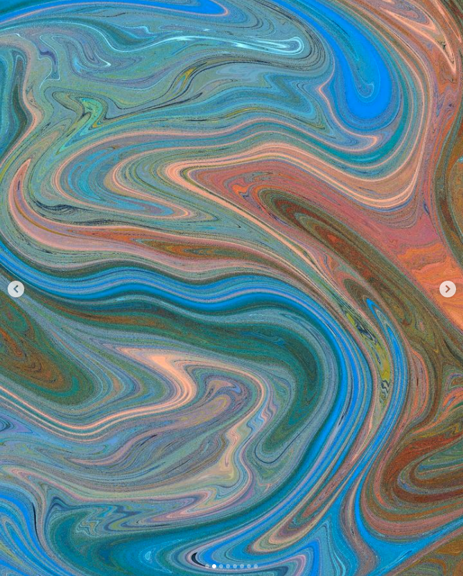
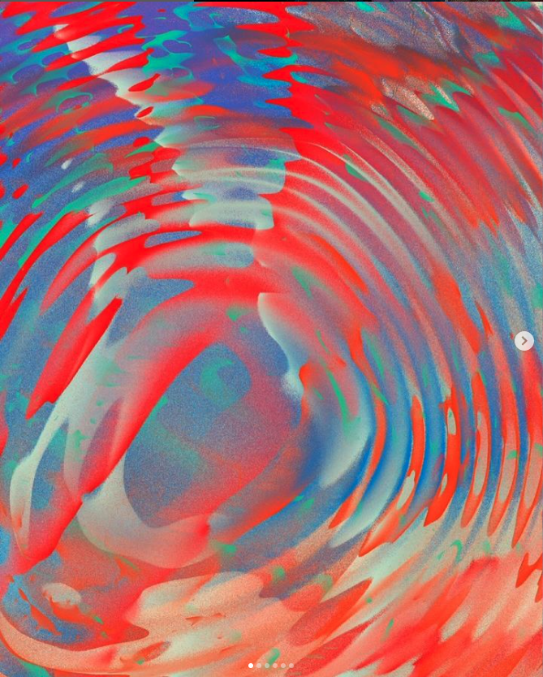
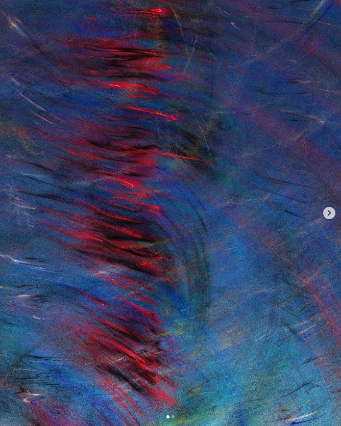
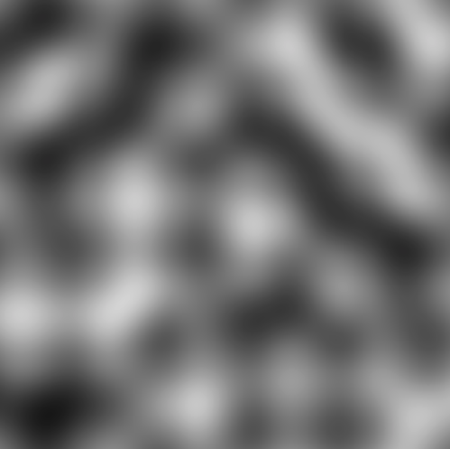
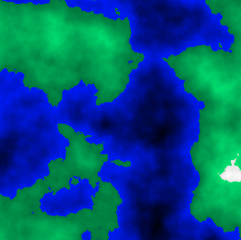

# Week 8 Quiz

## Part 1: Image Inspiration
I am inspired by a technique used in an artwork for generating random textures (see images below).

 This technique creates unique background textures using random brush strokes of yellow and blue, making it highly suitable for the background of my project titled "Apple Tree." The random yet harmonious combination of colours effectively simulates the interplay of light and shadow in natural environments, enhancing the visual impact.
 ## Part 2: Coding Exploration
 To achieve a background with random textures, I plan to use the Perlin Noise algorithm. This algorithm can produce continuous textures (see below image for code in action), which are perfect for simulating the chaotic textures.

 Additionally, by incorporating color parameters, Perlin Noise can create visual effects similar to contour lines (see below image). An example of the implementation code can be found at this link: https://github.com/rtouti/rtouti.github.io/blob/gh-pages/examples/perlin-noise.html
 